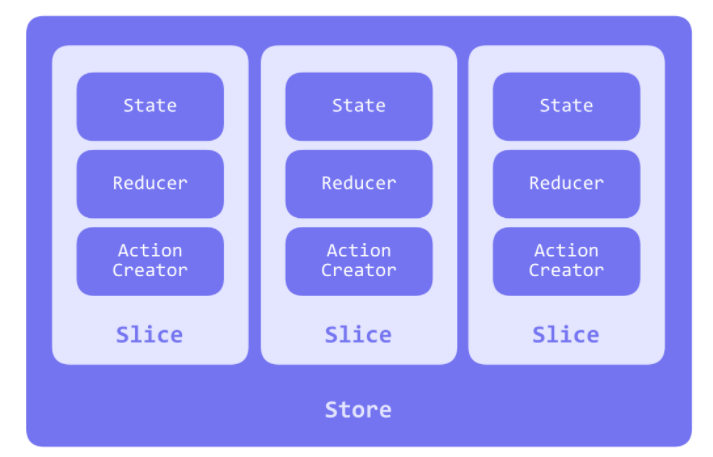

# RTK (Redux Toolkit)

## 1. 배경

리덕스는 Flux 아키텍처의 구현체로 대형 mvc 애플리케이션에서 나타나는 의존성 이슈, 연쇄적인 갱신이 뒤얽혀 데이터의 흐름을 예측할 수 없게 만들었던 문제를 해결하기 위해 고안됨

> Flux 아키텍처?  
> 양방향 데이터 흐름 때문에 복잡성이 생긴 문제를 단방향 데이터 흐름으로 만들어낸 아키텍처
> 

리덕스를 사용하는 구조에서 전역 상태를 전부 하나의 저장소(store)안에 있는 객체 트리에 저장하며,
어떤 일이 일어날지 서술하는 객체인 액션(action)을 내보내는 (dispatch) 것이 유일한 방법이다
그리고 액션이 상태를 어떻게 변경할지 명시하기 위해서 리듀서(reducer)의 작성이 필요하다

리듀서는 변화를 일으키는 함수로써 전달받은 액션을 가지고 새로운 상태를 만들어 스토어에 전달한다

리덕스 공홈에서는 리덕스 툴킷을 사용하도록 권장한다

why? 기존 리덕스는

- 리덕스 스토어 환경 설정이 복잡하고
- 리덕스를 유용하게 사용하려면 많은 패키지를 추가해야하고
- 보일러플레이트(어떤 일을 하기 위해 꼭 작성해야 하는 코드)를 요구

이를 해결하기 위해 toolkit 등장함

리덕스 사용 단계는 아래와 같음

1. set up (install RTK library ...)
2. store 생성 및 연결
3. slice 생성
4. slice, reducer 연결
5. view 구현: useSelector, useDispatch hook 통해 store 내장 값 호출

<br>

## 2. How To Use

### 2.1) set up

```bash
npm install @reduxjs/toolkit react-redux [redux-typescript]
npm install -D redux-devtools [@types/react-redux]
```

<br>

### 2.2) store 생성 및 연결

```typescript
// stores/config.ts
import { configureStore } from "@reduxjs/toolkit";
import reducer from "./rootReducer"; // combineReducer로 묶은 Reducer

export const store = configureStore({
  reducer,
});

export type RootState = ReturnType<typeof store.getState>;
export type AppDispatch = typeof store.dispatch;
```

`configureStore`로 store를 생성하고, 기존 redux의 createStore를 추상화한 것이다

`configureStore`를 생성하면 기본 미들웨어로 redux-thunk를 추가하고 리덕스 개발자 도구를 활성화해준다

<br>

```typescript
// index.ts
import { store } from "./stores/config.ts";

// ...

<Provider store={store}>
  <App />
</Provider>;

// ...
```

생성한 store를 `Provider` 컴포넌트에 주입시키면 된다

<br>

### 2.3 slice 생성

```typescript
import { createSlice, PayloadAction } from "@reduxjs/toolkit";
import { ITodo } from "../../types/todo";

const initialState = [] as ITodo[];

const todoSlice = createSlice({
  name: "todo",
  initialState,
  reducers: {
    addTodo: (state, action: PayloadAction<ITodo>) => {
      return [...state, action.payload];
    },
    deleteTodo: (state, action: PayloadAction<number>) => {
      return state.filter((t) => t.id !== action.payload);
    },
  },
});

export const { addTodo, deleteTodo } = todoSlice.actions;
export default todoSlice.reducer;
```

`createSlice`를 사용하면 action과 reducer를 생성해주는 함수가 내부적으로 사용되고,
선언된 name을 따라서 리듀서와 그에 상응하는 액션 생성자와 액션 타입을 자동으로 생성한다

간단히 말하면 리듀서 함수와 action creator를 포함한 객체를 리턴해준다

예1) addTodo의 action type -> todo/addTodo

예2) deleteTodo의 action type -> todo/deleteTodo

여기까지 봤을 때, RTK의 구조는 아래와 같다


<br>

### 2.4 slice, reducer 연결

```typescript
import { combineReducers } from "@reduxjs/toolkit";
import todoReducer from "./modules/todoSlice";

const reducer = combineReducers({
  todoReducer,
});

export type ReducerType = ReturnType<typeof reducer>;
export default reducer;
```

`combineReducers`를 이용해서 앞서 만든 모든 slice들을 하나로 모아준다

각 reducer를 호출하여 초기 상태를 검색하고 정리해서 초기 상태 트리를 만든다

<br>

### 2.5 view 구현: useSelector, useDispatch hook 통해 store 내장 값 호출

```tsx
import { AppDispatch } from "./stores/config";
import { ReducerType } from "./stores/rootReducer";
import { addTodo, deleteTodo } from "./stores/modules/todoSlice";

const inputRef = useRef<HTMLInputElement>(null);
const todos = useSelector<ReducerType, ITodo[]>((state) => state.todoReducer);
const dispatch = useDispatch<AppDispatch>();

const addHandler = () => {
  const id = todos.length > 0 ? todos[todos.length - 1].id + 1 : 0;
  const content = inputRef.current?.value || "";

  dispatch(
    addTodo({
      id,
      content,
    })
  );

  inputRef.current!.value = "";
};

const deleteHandler = (id: number) => {
  dispatch(deleteTodo(id));
};

return (
  <>
    <input name="content" ref={inputRef} />
    <button onClick={addHandler}>추가하기</button>

    {todos.map((t) => (
      <div className="todo" key={t.id}>
        <p>
          {t.id} - {t.content}
        </p>

        <button
          onClick={() => {
            deleteHandler(t.id);
          }}
        >
          삭제
        </button>
      </div>
    ))}
  </>
);
```

`useSelector`로 스토어에서 값을 조회해온다

타입을 지정해야할 경우 `useSelector<ReducerType, T>`으로 설정한다

`useDispatch`를 통해 변경할 값을 reducer에 전달해준다

근데.. 상태 트리가 갱신되어 컴포넌트를 다시 Render 해야하는 경우 새로운 인스턴스를 생성하게 된다 그래서 메모이제이션이 필요한데 이건 `createSelector`로 활용가능하다

#### ref

- https://ko.redux.js.org/introduction/getting-started
- https://blog.hwahae.co.kr/all/tech/tech-tech/6946
